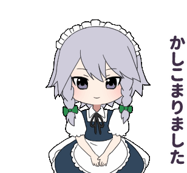

<link rel="stylesheet" href="style.css">

<!-- Profile Header -->

    
    <h1>नमस्ते (Namaste) 🙏🏻, I'm Souvik Ruhidas!</h1>
    
Passionate Frontend Developer | Tech Enthusiast | Bike Lover

<!-- About Me Section -->
# About Me

    

          
        🔭 I’m currently a 2nd year CSE student at SRM University  
        🤖 I'm interested in frontend development  
        🤝 Ready to team up for projects :)
    

    

<!-- Skills Section -->
# My Skills
<table>
  <tr>
    <td align="center" width="200">
      <a href="https://github.com/html">
        
         
        HTML5
      </a>
    </td>
    <td align="center" width="200">
      <a href="https://github.com/twbs">
        
         
        Bootstrap
      </a>
    </td>
    <td align="center" width="200">
      <a href="https://github.com/css">
        
         
        CSS
      </a>
    </td>
  </tr>
  <tr>
    <td align="center" width="200">
      <a href="https://github.com/facebook/react">
        
         
        React.js
      </a>
    </td>
    <td align="center" width="200">
      <a href="https://github.com/python">
        
         
        Python
      </a>
    </td>
    <td align="center" width="200">
      <a href="https://github.com/javascript">
        
         
        JavaScript
      </a>
    </td>
  </tr>
</table>

<!-- Contact Me Section -->
# Contact Me:

    
    
If you want to reach out to me about anything, be it some doubt or just to hangout and talk or want to game together just ping me 😉.

    

        
        
    

     
     
    

        
        
    

 

<!-- Footer -->

    
    
Thanks for visiting my Profile! 😊

